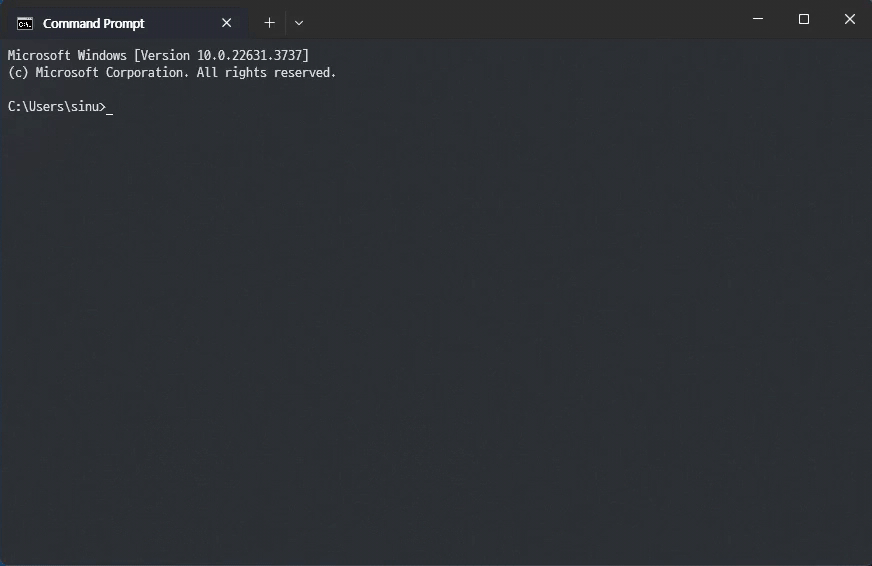

# Doofus

Doofus is a proof-of-concept implementation of an extensible, cross-platform, AI-powered command-line assistant.

It utilizes a powerful plugin system that can run any C# code at the user's request.



# Install

Doofus is made primarily for personal use, so for the installation you do you. I personally published it as a single file and put it in some directory on PATH.

You must provide an OpenAI API key to Doofus via the `config.json` file, that goes something like this:

```json
{ "openai-key": "YOUR KEY HERE" }
```

Place `config.json` file in the same directory as the Doofus executable.

# Usage

```
doofus [--verbose] [--language en-US] prompt
```

```
> doofus What is the maximum read speed of a UHS-I SD card?
The maximum read speed of a UHS-I SD card is 104 MB/s.
```

# Plugin development

If you want to create a custom plugin:

1) Create a class library project.
2) Add the `DoofusPluginBase` project as a reference.
3) Write a class that implements `IDoofusPlugin`. If you need examples, I'd recommend taking a look at the sample plugins, especially `GeneralQuestionPlugin`.
4) Build the project, grab the DLL file and throw it in the `plugins` directory which should be in the same directory as the Doofus executable.

If Doofus sees an external plugin in the `plugins` directory, it will not load the sample plugins. To load sample plugins along with external ones, add `"use-sample-plugins": true` to `config.json`.

# License

Doofus is distributed under the GNU GPL v3.